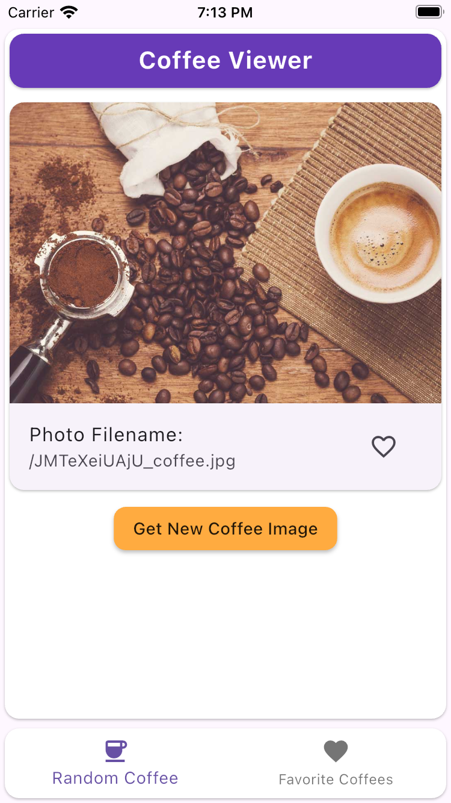
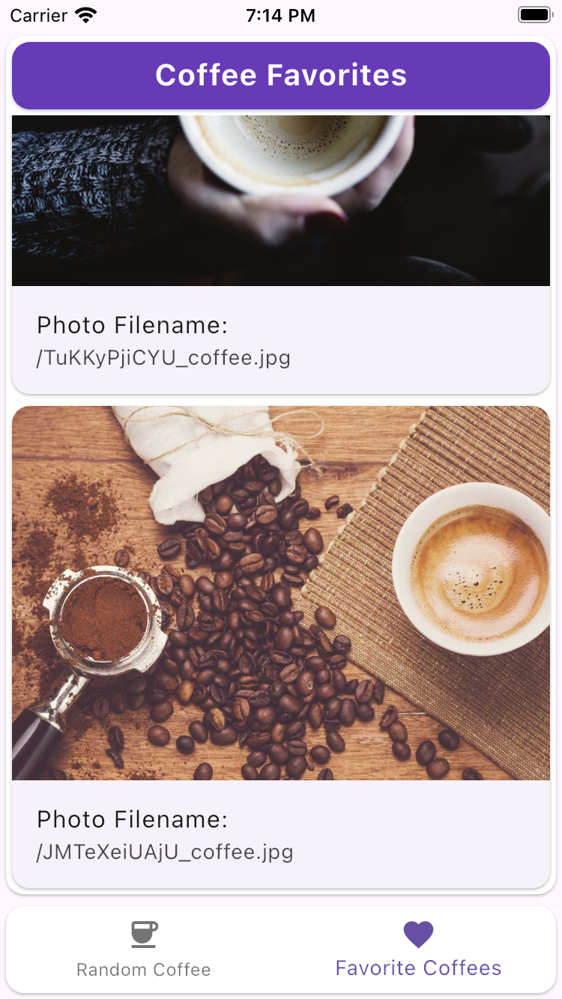
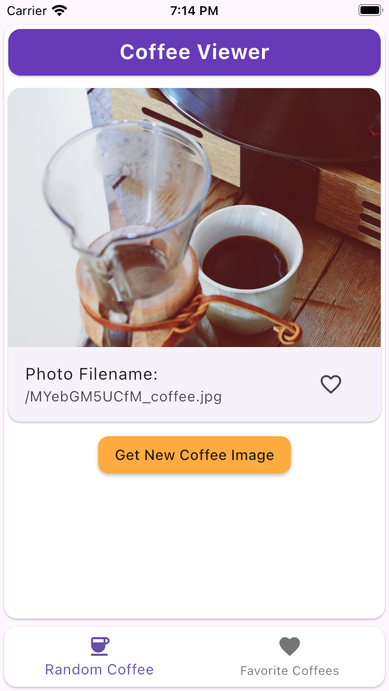

# VeryGoodCoffee ☕

![coverage][coverage_badge]
[![style: very good analysis][very_good_analysis_badge]][very_good_analysis_link]
[![License: MIT][license_badge]][license_link]

Generated by the [Very Good CLI][very_good_cli_link] 🤖

A Very Good Project created by Very Good CLI.

---

## Getting Started 🚀

This repository includes a Flutter Project for both iOS and Android.

The following steps detail how to get started:
1. Clone this repository on the command line, or download the project as a zip file
2. Install VSCode IDE on your Desktop
3. Open up either an iOS Simulator or Android Emulator in VSCode
4. Open the working directory folder in VSCode
5. Run the following command in the working directory through the terminal: `flutter run --flavor development --target lib/main_development.dart`
6. Interact and have fun with the app!

This app was built using BLoC state management, Clean Architecture for concern separation, and Get_it for Dependency Injection and Source Location.

## Using the App in the Simulator / Emulator 📱
1. Open the App manually by clicking on the app icon, or automatically through VSCode if this is a fresh install
2. View a random coffee image
3. If it pleases you, press the outlined heart icon to add it as a favorite image
4. If you no longer want the current image, you can press the red heart icon to un-favorite the image
5. Press the bottom navigation bar button entitled "Favorite Coffees" with the heart icon to see your favorites
6. Don't see your current favorite yet? Swipe down to refresh the list!
7. Scroll through the list to see all of your favorites, even without internet access!
8. Press the bottom navigation bar button entitled "Random Coffee" with the coffee icon to get a new image
9. Press the button entitled "Get New Coffee Image" to receive a new Random Coffee Image from the web

## Running Tests 🧪
Currently, there are 6 widget tests.

## Next Steps 🪜
1. Add the ability to remove favorites directly from the favorites list
2. Check for internet connectivity, and fail gracefully to account for this
3. Add Email / Text / Social Share capabilities

[coverage_badge]: coverage_badge.svg
[flutter_localizations_link]: https://api.flutter.dev/flutter/flutter_localizations/flutter_localizations-library.html
[internationalization_link]: https://flutter.dev/docs/development/accessibility-and-localization/internationalization
[license_badge]: https://img.shields.io/badge/license-MIT-blue.svg
[license_link]: https://opensource.org/licenses/MIT
[very_good_analysis_badge]: https://img.shields.io/badge/style-very_good_analysis-B22C89.svg
[very_good_analysis_link]: https://pub.dev/packages/very_good_analysis
[very_good_cli_link]: https://github.com/VeryGoodOpenSource/very_good_cli